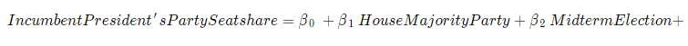
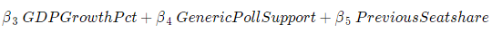

```{r setup, include = FALSE}
library(tidyverse)
library(stargazer)
library(lubridate)
library(caret)

# Load model data
seats_data <- read_csv("../data/house_popvote_seats.csv")
polls_data <- read_csv("../data/GenericPolls1942_2020.csv")
gdp_quarterly <- read_csv("../data/GDP_quarterly.csv")

# Wrangle data
ec_data <- gdp_quarterly %>% 
  filter(quarter_cycle == 7) %>% 
  select(year, GDP_growth_pct)

polls_wrangled <- polls_data %>% 
  filter(days_until_election <= 45) %>% 
  group_by(year) %>% 
  summarise(D_avg_poll_support = mean(dem),
            R_avg_poll_support = mean(rep))

model_seats_data <- seats_data %>% 
  select(year, R_seats, D_seats, R_majorvote_pct, D_majorvote_pct, president_party, H_incumbent_party) %>% 
  mutate(president_party_dummy = ifelse(president_party == "D", 1, 0)) %>% # president's party dummy
  mutate(H_incumbent_party_dummy = ifelse(H_incumbent_party == president_party, 1, 0)) %>% # incumbent party in House dummy
  mutate(midterm_dummy = ifelse(year %% 4, 1, 0)) %>% # midterm election dummy
  inner_join(ec_data, by = "year") %>% 
  left_join(polls_wrangled, by = "year") %>% 
  mutate(incumbent_pres_majorvote = ifelse(president_party == "D", D_majorvote_pct, R_majorvote_pct),
         incumbent_pres_seats = ifelse(president_party == "D", D_seats, R_seats),
         incumbent_pres_seatshare = 100 * incumbent_pres_seats / 435,
         incumbent_pres_poll_support = ifelse(president_party == "D", D_avg_poll_support, R_avg_poll_support),
         prev_seatshare = ifelse(president_party == "D", 
                                 lag(100 * D_seats / 435),
                                 lag(100 * R_seats / 435))) %>% 
  filter(year >= 1954) # Removes years with NA values

# Model 1: Everything combined
combo <- lm(incumbent_pres_seatshare ~ H_incumbent_party_dummy + midterm_dummy + GDP_growth_pct + incumbent_pres_poll_support + prev_seatshare, data = model_seats_data)
# stargazer(combo, type = "text")

# Load and clean prediction data
polls_2022 <- read_csv("../data/generic_ballot_polls_final.csv") %>%  # pulled from https://projects.fivethirtyeight.com/polls/generic-ballot/ on 11/7 
  filter(cycle == 2022) %>% 
  mutate(start_date = mdy(start_date)) %>% 
  filter(start_date >= ymd("2022-09-24")) %>% 
  summarise(D_avg_poll_support = mean(dem),
            R_avg_poll_support = mean(rep))
  
prediction_data_2022 <- NA
prediction_data_2022$midterm_dummy <- 1
prediction_data_2022$incumbent_pres_poll_support <- polls_2022$D_avg_poll_support
prediction_data_2022$H_incumbent_party_dummy <- 1
prediction_data_2022$GDP_growth_pct <- 2.6 # Source is Bureau of Economic Analysis https://www.bea.gov/data/gdp/gross-domestic-product
prediction_data_2022$prev_seatshare <- 51.03448

# Make a prediction
predictions <- data.frame(model = "prediction",
                          final = predict(combo, prediction_data_2022, interval = "predict"))

# LOOCV
ctrl <- trainControl(method = "LOOCV")
cv_model <- train(incumbent_pres_seatshare ~ H_incumbent_party_dummy + midterm_dummy + GDP_growth_pct + incumbent_pres_poll_support + prev_seatshare, 
                  data = model_seats_data,
                  method = "lm",
                  trControl = ctrl)

# Visualization
Party <- c("Republican", "Democrat")
seats <- c(224, 211)
leg <- c("house", "house")
vis_data <- data.frame(leg, Party, seats)

seatshare_vis <- ggplot(vis_data, aes(fill = Party, x = leg, y = seats)) +
  geom_bar(position="stack", stat="identity", width = 0.5) +
  scale_fill_manual(values = c("#30a2da", "#fc4f30")) +
  geom_hline(yintercept = 217.5, size = 1) +
  labs(title = "2022 House Midterm Election Prediction") +
  ylab("Seats Held") +
  theme(axis.title.y = element_blank(),
        axis.ticks.y = element_blank(),
        axis.text.y = element_blank(),
        panel.grid.major = element_blank(), 
        panel.grid.minor = element_blank(),
        panel.background = element_blank()) +
  ylim(0, 435) +
  coord_flip()
```
# Introduction

This week I'll be making my final prediction for the 2022 House Midterm elections. My final model is a linear regression model using national data from 1954-2020 in order to predict the outcome of this year's midterms based on 2022 data. I predict that the **Democrats will win 48.58% of the seats in the House**, which nets about **211 seats for the Democrats** and **224 seats for the Republicans**.

```{r vis, echo = FALSE}
seatshare_vis
```

# Model



My outcome variable is the House seatshare percentage of the party of the sitting president. As an example, this would measure the seatshare of the Democratic Party in 2022 and the Republican Party in 2018. My predictors are as follows:

1. House Majority Party: an indicator for whether the House majority party is also the party of the sitting president
2. Midterm Election: an indicator for whether a given election is a midterm election
3. GDP Growth Pct: percentage-point difference in GDP from Q6 to Q7 where Q7 is the third quarter of the calendar year of the election
4. Generic Poll Support: the average generic ballot support for the sitting president's party aggregated over the 45 days leading up to the election
5. Previous Seatshare: the previous House seatshare of the sitting president's party

# Justification

For my outcome variable, I had to think carefully about what seatshare even meant. Given that the president's party tends to lose seats during midterm elections, I wanted to construct my outcome in such a way that my model can determine if the president's party actually suffers during midterms. Instead of calculating the seatshare of the Democrats or Republicans for each election, opting instead to calculate the seatshare of whatever party controls the presidency means that I am always looking at the president's party during the midterm elections. Since we have a two-party system in this country, finding the seatshare of one party allows us to find the seatshare of the other party, so we don't lose any information by setting up the outcome in this way. I then added an indicator that noted whether a given year was a midterm election cycle. I also wanted to examine whether voters are sensitive to the makeup of the House at all, so I included another variable that indicated whether the House majority party was also the sitting president's party. On further review this may not have been the best approach but I will be saving my thoughts on this for my conclusion.

Drawing on [Achen & Bartels](https://hollis.harvard.edu/primo-explore/fulldisplay?docid=TN_cdi_askewsholts_vlebooks_9781400888740&context=PC&vid=HVD2&search_scope=everything&tab=everything&lang=en_US), who argued that voters use a myopic form of rational retrospection by taking recent economic factors into account when choosing candidates, I included Q7 GDP growth as an economic indicator that affects voters nationwide. Q7 is the quarter right before the election, which I think would be the most fresh in the minds of voters, and recency is very important for voters who are thinking about the past in order to pick candidates for office. I tried other economic indicators like RDI, but they just weren't very predictive. 

I used the national generic ballot instead of other kinds of polls for one main reason: people don't know who their representatives are. If you ask a random person on their street who their House representative is, the only thing they would probably know is their party. Instead of using popularity polls of specific candidates, which would have to be aggregated and introduce bias since they're localized by district, generic ballots offer information about partisan support nationwide. Since party is such a powerful heuristic for people picking House representatives, I decided to stick with that. On top of this, I drew on [Gelman & King](https://hollis.harvard.edu/primo-explore/fulldisplay?docid=TN_cdi_gale_infotracacademiconefile_A14564056&context=PC&vid=HVD2&search_scope=everything&tab=everything&lang=en_US) and their findings on the importance of recency in polls where they note how polls converge towards the election outcome the closer they are taken to election day. I decided to only look at generic polls taken within 45 days of the election, as this is both an important milestone the campaigns and media use and a number that doesn't remove too many polls from my dataset.

I used previous seatshare as a somewhat hacky predictor. In some ways it feels like cheating, but if you know how many seats one party had last election, you will probably have a good idea of how many seats they are going to have this election. For the sake of accuracy, it seemed like a good idea to include this variable even though it doesn't teach us much about how people think about elections.

Over this semester, I've had the opportunity to look at a lot of different predictors and think about what they mean in the context of voter behavior. You can look at my blog posts from previous weeks, but there were many predictors that didn't end up in my final model such as turnout, economic shocks, expert predictions, etc. Most of the time, this was because the data either had no statistical significance or didn't have enough historical observations to draw any conclusions from. The predictors I kept in my model were the ones that proved the most robust given the outcome of House seatshare that I was trying to predict.

# Results
```{r, echo = FALSE}
stargazer(combo, type = "text", covariate.labels = c(
  "House Majority Party", "Midterm Election", "GDP Growth Percent", "Generic Poll Support", "Previous Seatshare"),
  dep.var.labels = "Seatshare of Incumbent President's Party")
```

# Coefficients

All of the coefficients are significant, with the exception of the constant. Below is my breakdown of each coefficient:

1. House Majority Party (3.317): If the House majority party is also the president's party, the president's party is expected to win an extra 3.317% of the House.
2. Midterm Election (-4.584): During midterm elections, the president's party is expected to win 4.584% less seats than in non-midterm elections.
3. GDP Growth Percent (-0.299): For each percentage-point increase in GDP in Q7, the president's party is expected to win 0.299% less seats in the House. This is a confusing result that I'm still trying to wrap my head around as this means voters punish the president's party for good economic performance. Perhaps this is the result of me not taking into account the fact that the GDP is always growing on average. 
4. Generic Poll Support (0.625): For each percentage-point increase in generic poll support, the president's party is expected to gain an extra 0.625% seats in the House.
5. Previous Seatshare (0.353): For each percentage-point increase in seatshare of the president's party in a given election, that party is expected to gain an extra 0.353% seats in the House during the next election.

# In-Sample Validation with Adjusted R-Squared

My model has an adjusted r-squared value of 0.877 which means that my independent variables explain 87.7% of the variation in my dependent variable. If you believe in adjusted r-squared, this is really good. Note that you don't want a value that's too high or too low. Given that I've had adjusted r-squared values of 1 and below zero in past weeks, I'm really happy with this result. 

# Out-of-Sample Validation using LOOCV

Using leave one out cross-validation (LOOCV), we can determine how well our model performs on data that hasn't been seen before by removing one observation, running our regression, and then measuring the error between our model and the observation we removed. Below are the results of running LOOCV on my model:

```{r loocv, echo = FALSE}
print(cv_model)
```

I'm going to ignore r-squared since I alread looked at that in the above section. Running LOOCV on my model produces a root mean squared error (RMSE) of about 3.41% seatshare for the president's party and a mean absolute error of about 2.80% seatshare for the president's party. Note that RMSE penalizes large errors more heavily than MAE, which means that it is more sensitive to weird election years. Despite this sensitivity, both measures seem pretty reasonable. However, the values that I got are exactly the kind of margins of error that got many pollsters in trouble during 2016 when they got the outcome of the presidential election wrong. After Trump's surprise victory, many pollsters said their polls weren't wrong and that the outcome of the election was still within their margins of error; the only issue was that the victory cutoff fell within these margins and the polls were communicated in such a way that people ignored the uncertainty of these polls. 

My model's prediction is vulnerable to this very problem. With another very competitive midterm election ahead of us, the Democrats only need to outperform my prediction in 7 seats (about 1.6% seatshare) in order to keep their majority in the House. This is well within my margins of error established by LOOCV, so it will be interesting to see whether my model will have called the election correctly once the dust settles.

# Predictive Interval

```{r pred_interval, echo = FALSE}
knitr::kable(predictions[, 2:4], col.names = c("Prediction", "Lower Bound", "Upper Bound"), "simple")
```

The 95% predictive interval for my prediction is quite wide, but still a reasonable one that I believe to be within the realm of possibility. A 95% predictive interval states that if observations in my dataset are part of a distribution, and if I were to keep sampling from this distribution infinitely (i.e. if we were to keep holding elections), then 95% of these new observations would fall within this interval. And if we look at the lower bound of 41.77% seatshare and the upper bound of 55.39% seatshare, I think this looks pretty good. Unless the American political system fundamentally changes in the future, I think it is highly unlikely that we see one party go outside this general range.

*Note that this interval is not centered at 50%, so technically it is possible for the president's party to be within the interval and push the other party outside the interval, but from a general standpoint I think the interval makes sense.*

# Conclusion

Everything included (and everything not included) in this model is the final product of 8 weeks of analyzing data and reading political science literature. A lot of my work with this data has felt like banging my head against the wall but I'm really happy with my final model. I'm currently working on a pooled model that takes similar incumbency and economic variables into account to predict each district and then tally their results up to build a forecast of the election, but I couldn't end up finalizing it in time. My pooled model will end up going into a later bonus blog post, so stay tuned for that! 

As promised, I wanted to revisit the inclusion of my variable that indicates whether the House majority party is also the president's party. On further review, I think that this variable only captures whether there is a strong wave of support for a given party. If a party controls the House and the Presidency, chances are they are going to do better in the next election than if they didn't. I don't really think it says anything useful about voter behavior with respect to the makeup of the federal government, but I felt like leaving it in because it had some significance and I wanted it to serve as a reminder of my questions surrounding voter behavior.

In closing, making a predictive model of the House midterm elections is really hard. The data is very limited, voters don't have much information about the election, and coding can be really annoying (like when my package dependencies decide to revert themselves to past versions and break everything). I hope my prediction is wrong, but I do agree with the general sentiment that the Democrats are going to be losing some seatshare this election.  
